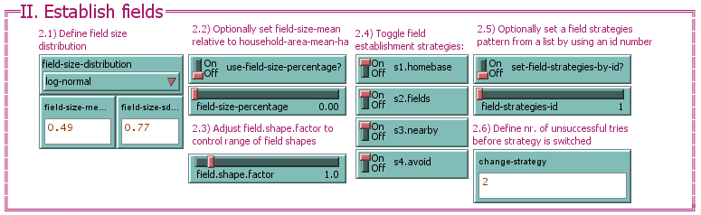
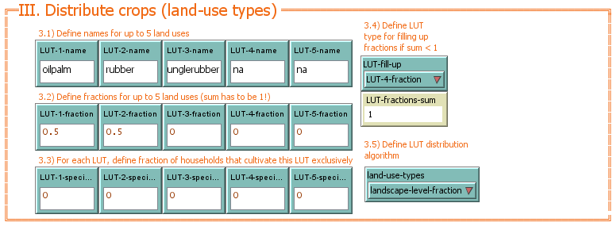

# Functionality and Parameterization {#funcpar}


## Functionality

THE MODEL WORKS LIKE THAT


## Parameterization

All parameters on the graphical user interface are numbered. The following sections guide you through parameterization of the model.

### Setup landscape and households

The parameters in the blue colored section of the EFForTS-LGraf GUI are used for model setup.
World dimensions, scale parameters, road setup, household, village and field sizes are some of the parameters that are defined in this section.

```{r, echo=FALSE, fig.cap="Setup parameters"}
knitr::include_graphics("figures/EFForTS-LGraf_interface_I.png")
```

| nr | description |
| --- | -------------------------- |
| 1.1 | First define if a randomly drawn seed will be used or set a specific seed to make map generation reproducible |
| 1.2 | Set the dimensions of the landscape in cells, and the corresponding cell resolution in meter (used for area calculations) |
| 1.3 | Choose algorithm for road creation |
| 1.3.1 | If `real-road-map` has been chosen in 1.3, add a string identifier for the map (see section Use own road shapefiles as road templates below for guidance on using own road shapefiles) |
| 1.3.2 | If an artificial road generation algorithm has been chosen in 1.3, define the number of road cells and the minimum distance between roads |
| 1.3.3 | If `artifical.perlin` has been chosen in 1.3 define the parameters for the perlin noise algorithm |
| 1.4 | Set the maximum number of trials for loops. Depending on the parameterization, a low value may result in landscapes that do not represent the specified needs accurately. Larger numbers may increase simulation time. |
| 1.5 | Define the number of households that are allowed to have a homebase on the same cell |
| 1.6 | Choose a setup type: </br> - number-of-households: Define a total number of households in 1.7 </br> - number-of-villages: Define a total number of villages in 1.7 </br> - proportion-agriculture: Define the final proportion of fields in the landscape in 1.7 |
| 1.8 | Define household parameters. Here you can define the area distribution of households in the landscape. You can define the type of distribution from which household areas are drawn during initialization. You can also define the parameters of these distributions. |
| 1.9 | Define village parameters. Here you can define the area distribution of villages (accumulation of households) in the landscape. You can define the type of distribution from which village areas are drawn during initialization. You can also define the parameters of these distributions. |
| 1.10 | Define the minimum distance between villages in cells. For certain parameterizations, this distance might not be realized. In such cases, a warning will appear that distances between villages are lower than specified. |
| 1.11 | This experimental feature allows to create a second type of household in the model, that uses a different area distribution (as defined in 1.11.2). |
| 1.12 | Define inaccessible areas that are created during setup. These areas are not available for field creation by smallholder households. These areas may represent conservation areas or company plantations that are not owend by smallholders. These areas can be connected to roads or placed randomly on the map. You can define the proportion of the landscape covered by these areas and their distribution. |

**Dangerous parameter combinations:** 
</br> - the theoretically maximum possible number of households is `total-road-length` (1.3.2) * `households-per-cell` (1.5), but can be reduced by road-connected inaccessible areas; to be safe choose a number of households less than half the maximum number
</br> - a high number of households or villages and a big household area can lead to a theoretically covered area bigger than the model area, especially in combination with a high fraction of inaccessible areas. This leads to a realized agricultural area much smaller than intended.
</br> - village size should be big enough to accomodate several households

### Establish fields

The parameters in the magenta colored section of the EFForTS-LGraf GUI are used for the field establishment procedure.
Here you define the field size distribution and control the strategies that are used for field establishment.

```{r, echo=FALSE, fig.cap="Field establishment parameters"}

```

| nr | description |
| --- | -------------------------- |
| 2.1 | Define the field size distribution for the field establishment procedure. Minimum field size is one cell. Field size should not be bigger than household size, otherwise it would lead to an unexpectedly large agricultural area. |
| 2.2 | Instead of defining a specific mean value for the field size distribution, you can use the `field-size-percentage` slider to calculate the mean dynamically, depending on the mean value of the household area distribution. |
| 2.3 | The field shape factor allows you to define if fields should be mostly quadratic (value = 1) or narrow (values &gt; 1 and values &lt; 1) |
| 2.4 | Select a set of field establishment strategies. Four strategies are currently implemented. Pre-defined combinations of these strategies can also be selected using parameters of 2.5. A household will try to establish a field under the current strategy for a specified number of tries (as defined in 2.6). If a household does not succeed with the current strategy, it will switch to the next strategy in numeric order (e.g. if all strategies are available and the current strategy is s1.homebase, it will switch to s2.fields). </br> - s1.homebase - Households will search for empty cells around their homebase to establish fields </br> - s2.fields - Households will search for empty cells around already established fields to establish new fields </br> - s3.nearby - Households will search for empty cells in an gradually increasing radius around their homebase </br> - s4.avoid - Households will search for empty cells around their homebase, that are only surrounded by empty cells |

2.5 

The available sets of strategies to choose from. The first enabled strategy will always be used first.

| Id | homebase | fields | nearby | avoid |
|:---:|:----------:|:-------:|:--------:|:-------:|
| 1 | &#10004; | &#10004; | &#10004; | &#10004; |
| 2 | &#10004; | &#10008; | &#10004; | &#10004; |
| 3 | &#10004; | &#10004; | &#10008; | &#10004; |
| 4 | &#10004; | &#10008; | &#10008; | &#10004; |
| 5 | &#10008; | &#10004; | &#10004; | &#10004; |
| 6 | &#10008; | &#10008; | &#10004; | &#10004; |
| 7 | &#10008; | &#10004; | &#10008; | &#10004; |
| 8 | &#10008; | &#10008; | &#10008; | &#10004; |

### Distribute crops

The parameters in the orange colored section of the EFForTS-LGraf GUI are used for the crop distribution procedure.
Here you define the names, proportions and specialization levels of crop classes that are distributed to the fields.

```{r, echo=FALSE, fig.cap="Crop distribution parameters"}

```

| nr | description |
| --- | -------------------------- |
| 3.1 | Optionally, define names for up to five different crop types |
| 3.2 | Define fractions of each crop type. The sum of these fractions must add up to one. If it is smaller than 1 the fraction of the land use type selected at 3.4 is increased until the sum is 1. |
| 3.3 | Optionally, for each crop type define the fraction of households that only culativates this crop type. For example, if specialization of crop type 1 is set to 1, each household which cultivates crop type 1, will only cultviate this land-use type (these fractions are only used, if 3.5 land-use-types is set to `household-level-specialization`) |
| 3.4 | Here you can define one of the 5 land-use types which is used to fill up remaining fractions if the defined fractions do not sum up to one. |

## Artificial road creation

You can choose one of two road creation algorithms, either graffe or perlin. For both you'll have to set the parameters `total-road-length` and `min-dist-roads` (the unit for both is cells).

The graffe altgorithm produces straight roads like these: 

```{r, echo=FALSE}
knitr::include_graphics("figures/screenshot_graffe.PNG")
```

The perlin algorithm produces contorted roads. The perlin parameters can be set at 1.3.3) to influence the street layout. For examples of how the parameters change the street layout see below:

```{r, echo=FALSE, out.width="33%", fig.cap="Left: all parameters with minimum value; middle: `cone-angle` high;right: `dist-weight` high",fig.show='hold',fig.align='center'}
knitr::include_graphics(c("figures/screenshot_perlin-all-low.PNG","figures/screenshot_perlin-cone-angle.PNG","figures/screenshot_perlin-dist-weight.PNG")) 
```

## Using custom road shapefiles

Instead of generating roads, EFForTS-LGraf is able to use an existing roadmap shapefile as input by selecting `real.shapefile` from the dropdown menu under 1.3. These shapefiles are loaded from the folder "LGraf_roadmaps" within the input folder of the model directory.
Own shapefiles can be added here. Please note, own shapefiles need to follow a specified filename format as shown below. At least three files need to be available to load a roadmap shapefile:
* &lt;roadmapid&gt;_road.prj - the projection file of the roadmap
* &lt;roadmapid&gt;_road.shp - the actual shapefile containing road polylines
* &lt;roadmapid&gt;_area.shp - a shapefile with a framing box of the road shapefile which is used to set the dimensions of the landscape

You can replace &lt;roadmapid&gt; with any string, which can then be entered in the input field `road-map-id` under 1.3.1 to load the shapefile. For example, a valid fileset could be named "mymap1_road.prj", "mymap1_road.shp", "mymap1_area.shp". This fileset can then be loaded by selecting `real.shapefile` under 1.3 and entering `mymap1` into the input field under 1.3.1.

Five roadmap shapefiles from Jambi, Indonesia are already included in EFForTS-LGraf. These shapefiles can be loaded by entering `jambi1`, `jambi2`, `jambi3`, `jambi4` or `jambi5` under 1.3.1).

## EFForTS-LGraf output functions

The main output function of EFForTS-LGraf is executed by pressing the "Write output" button on the GUI (IV. Paint & Output). This function will write the following spatial information to disk:

| filename | type | content |
|---|---|--------| 
| forest-patch-raster | ASCII raster | forest patch IDs |
| hh_points_layer | ESRI Shapefile | Point features generated from household agents |
| hh-tpye-1-raster | ASCII raster | counts of households with type 1 on each cell |
| hh-tpye-2-raster | ASCII raster | counts of households with type 2 on each cell |
| homebase-raster | ASCII raster | Household IDs on homebases of household agents |
| homebase-raster_layerN | ASCII raster | Optional files for each layer of household homebases. Only relevant if `households-per-cell` > 1 and only created if `write-household-ids` is set to "layered files" |
| land-use-type-raster | ASCII raster | crop type IDs |
| ownership-raster | ASCII raster | Ownerhsip household IDs of fields |
| patch-id-raster | ASCII raster | Patch IDs |
| road-raster | ASCII raster | Roads cells |
| roads_polyline_layer | ESRI Shapefile | Road cells as polyline shapefile |
| village-raster | ASCII raster | Village IDs of homebase cells |

The output files are written to the specified subfolder/path `foldername`. In order to write output, the specified folder/path need to exist.

The NetLogo GIS extension allows to map the NetLogo coordinates to a specified envelope of GIS coordinates.
This can be done by activating the `apply-gis-envelope?` switch and specifying the boundary coordinates of the GIS envelope. These coordinates are specified as a list (`[minimum-x maximum-x minimum-y maximum-y]`) in the input field `gis-envelope`. Additionally, spatial output can be created with a specified projection system. In order to set the projection, activate the switch `apply-gis-projection?` and specify a "*.prj" file with projection definitions in the input field `gis-projection` (see [NetLogo user manual](https://ccl.northwestern.edu/netlogo/docs/gis.html#gis:load-coordinate-system) for more information).

## Visual map output

### paint.default.map

The `paint.default.map` function in section IV. Paint and Output creates maps highlighting certain categories chosen with the `default.maps`chooser. The results can be saved as a .png-file using the `screenshot` function.

The following options are available:

```{r, echo=FALSE, out.width="80%", fig.cap= "forest-non-forest: paints forest, fields and inaccessible areas in different colours"}
knitr::include_graphics("figures/screenshot_forest-non-forest.PNG")
```

```{r, echo=FALSE, out.width="80%", fig.cap= "landuse: paints forest, fields, inaccessible areas, roads and homebase cells in different colours"}
knitr::include_graphics("figures/screenshot_landuse.PNG")
```

```{r, echo=FALSE, out.width="80%", fig.cap= "landuse-type: paints the different crops, inaccessible areas and homebase cells in different colours"}
knitr::include_graphics("figures/screenshot_landuse-type.PNG")
```

```{r, echo=FALSE, out.width="80%", fig.cap= "field-patches: paints each field and inaccessible areas in a different colour"}
knitr::include_graphics("figures/screenshot_field-patches.PNG")
```

```{r, echo=FALSE, out.width="80%", fig.cap= "household-patches: paints the fields belonging to one household in one color and shows the id of each individual household starting with 0; -1 is the forest/landscape matrix"}
knitr::include_graphics("figures/screenshot_household-patches.PNG")
```

```{r, echo=FALSE, out.width="80%", fig.cap= "forestcluster: paints forestclusters and shows their ids starting with 0; -1 are fields (gray is field on this map not forest/matrix)"}
knitr::include_graphics("figures/screenshot_forestcluster.PNG")
```

### paint.all
`paint.all` is the function used to create the maps generated by `paint.default.map` but all options can be chosen individually by the user.

`paint-cells`: colours the cells based on the chosen property, which can be one of the following:  

- landuse: forest, field or inaccessible area

- landuse-type: crops, homebases, inaccessible areas, forest  

- id: connected patches with the same age and land use have the same id, so each field and forest cluster has its own id   

- owner: fields belonging to the same household  

- forestcluster_id: forestcluster all get the same colour, fields and inaccessible areas each another   

`label-cells`: labels the cells based on the chosen property, duplicate labels are removed.

`paint-homebase-cells` paints homebase cells

`paint-road-cells` paints road cells

`show-households` shows households like this:  

```{r, echo=FALSE, out.width="80%", fig.cap="paint.all with show-households, paint-homebase-cells and with `paint-cells` landuse-type "}
knitr::include_graphics("figures/screenshot_show-households.PNG")
```