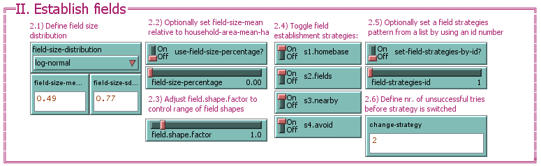
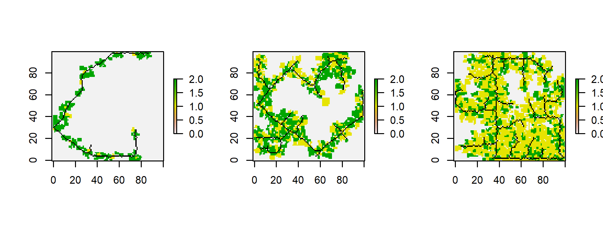

# Application examples {#application}

In this section you will find several application examples for EFForTS-LGraf.
These range from very detailed examples, covering all aspects of parameterization and output creation (e.g., \@ref(fromscratch)) to small little snippets explaining only some important aspects of EFForTS-LGraf.
The examples are structured in two sections. Examples in section \@ref(standalone) show how EFForTS-LGraf can be used as a standalone tool using only NetLogo. Examples in section \@ref(nlrx) show how the R package nlrx can be used to automate landscape creation.

## Standalone application examples {#standalone}

### Example 1: A landscape from scratch {#fromscratch}

#### Step 1: Prerequisites

In order to use EFForTS-LGraf as a standalone tool, you only need to adjust the parameters to your needs (see Section \@ref(funcpar)).
Here we will show you a simple example of how this can be done.

Lets imagine we performed a household survey of smallholder farmers and explicitly asked for:

* size of their fields (which also gives us the total size of each household)
* crop types on their fields

From remote sensing we estimate:

* road density/road length within study area
* field area of villages

#### Step 2: Parameterize and execute road and household setup


```{r, echo=FALSE, out.width="100%", fig.cap="Setup parameters"}
knitr::include_graphics("figures/EFForTS-LGraf_interface_I.png")
```

We now want to create maps along an intensity gradient with similar characteristics and need to parameterize EFForTS-LGraf:

* We want reproducible maps, thus we set `reproducible?` to TRUE and select a `random-seed` (1.1)
* Our cell size should be 50x50m and we want to simulate maps with 100x100 cells (1.2)
* Because we do not have road data, We use an artifical road creation algorithm (1.3, `artificial.perlin`)
* We set the number of road cells we want to create (1.3.2)
* Because we want to create maps along an intensity gradient, we choose the setup-type `agricultural-area` (1.6). We can then define the proportion of agricultural area our resulting map should have (1.7). E.g., we can create three maps, with increasing proportion of agricultural area.
* We calculate a household size distribution from our survey and use it to parameterize 1.8
  * log-normal distribution, mean = 1 ha, sd = 0.5ha
* We calculate a village area distribution from our survey and use it to parameterize 1.9
  * normal distribution, mean = 50ha, sd = 3ha
* We expect that one percent of the area is covered by large company plantations. We use the inaccessible area feature to create these plantations by setting the `inaccessible-area-fraction` to 0.1 (1.12)

Once all these parameters are porperly defined, press the button "I. Setup landscape and households" to execute model initialization.
This procedure will setup the initial landscape with roads, villages, households and inaccessible areas as specified.

#### Step 3: Parameterize and execute field establishment

```{r, echo=FALSE, out.width="100%", fig.cap="Field establishment parameters"}

```

During model initialization, households have been created with a specific household area, drawn from the household area distribution.
During the field establishment procedure, households will realize this household area by establishing fields. Each time a household establishes a field, a field size will be drawn from the defined distribution. More details on field establishment can be found in the accompanying publication.

* Next, we calculate the field size distribution from our survey and use it to parameterize 2.1
  * log-normal distribution, mean = 0.49 ha, sd = 0.77 ha
  * Because we want to use these dsitribution values, it is important to turn `use-field-size-percentage` off, otherwise the mean of the distribution would be estimated depending on the defined household area distribution.
* We want to use all available field estaiblishment strategies (2.4) and define that households change strategies after 2 unsuccessful tries (2.6)

Once all these parameters are porperly defined, press the button "II. Establish fields" to execute field establishment.

#### Step 4: Parameterize and execute crop distribution

```{r, echo=FALSE, out.width="100%", fig.cap="Crop distribution parameters"}
knitr::include_graphics("figures/EFForTS-LGraf_interface_III.png")
```

* Finally, from our survey we estimated a proportion of 50% rubber and 50% oilpalm on fields. We set the parameters accordingly (3.1, 3.2). Because we do not want to consider any specialization, we set the `land-use-types` parameter to `landscape-level-fraction` mode, which just distributes the fractions to the fields as accurately as possible and does not consider any specialization levels.

Once all these parameters are properly defined, press the button "III. Distribute crops" to distribute crops to all fields in the landscape.

#### Step 5: Investigate landscape and output


```{r, eval=FALSE, echo=FALSE, fig.cap="Output"}
knitr::include_graphics("figures/EFForTS-LGraf_interface_output.png")
```

[](https://raw.githubusercontent.com/nldoc/EFForTS-LGraf.bookdown/master/figures/EFForTS-LGraf_interface_output.png)
```{r, echo=FALSE, out.height="0.01cm%", fig.cap="Output"}
knitr::include_graphics("figures/spacer.png")
```

EFForTS-LGraf provides several ways to investigate model output:

* Performance
  * In box "V. Model output", the switch `print-messages?` can be activated to print a model performance report after each procedure execution. This report will tell you detailed information on current procedures. For example, the report will warn you if some of the specified landscape parameters could not be realized. 
  * In box "IV. Paint & Output", the switch `write-param-file?` can be activated to automatically store a parameter file of the current run. This can be useful for debugging purposes. The file will be saved in the main output folder as defined in the input field `foldername`. You can only define a folder name that is already existing in the main directory of EFForTS-LGraf (e.g. `output`). 
* Paint
  * In box "IV. Paint & Output", two main painting functions are available to display generated maps:
  * `paint.default.map` will apply a predefined color scheme on the current map. The scheme can be selected from the drop-down menu below the button.
  * `paint.all` lets you define a custom color scheme. You can choose from several cell variables, add labels and turn on/off certain spatial features.
  * `create-3D-map` is an experimental feature that allows to spawn NetLogo agents in different shapes and colors (trees, houses) to create a 3-dimensional version of the landscape. Currently, this function displays palms and trees to represent typical crops of our case study region in Jambi, Indonesia. However, with little code adjustments, other crop types can be displayed in a similar fashion. After exeucting the button, right click on the world view and select `Switch to 3D View`.
* Plot
  * In box "V. Model output" several plots give you some information about expected and realized size distributions of households, villages, fields and inaccessible areas. You can also check if the defined crop proportions could be realized within the generated landscape.
* Export
  * In box "IV. Paint & Output" you can store the current landscape as ascii/shp files by pressing the button `write output`. In order to define a location for output files, you need to enter an already existing subfolder directory in the `foldername` input field.

#### Step 6: Export output and load spatial data into R

We might want to write our map to disk and load it into R to perform further analysis.
First, we need to set the projection and gis envelope of the landscape:

* For example, we want to map the landscape to the envelope of the provided jambi1 road file. Thus, we define `gis-envelope` as `[238244 243244 9789775 9794775]` and activate `apply-gis-envelope?` 
* Next, we use the projection file of the jambi1 road map to define the projection system. Thus, we define `gis-projection` as `input/LGraf_roadmaps/jambi1_road.prj` and activate `apply-gis-projection?`
* In order to use the default output folder, we define `foldername` as `output` and press the button `write output`

These files can now be loaded into R as spatial objects:

``` {r, eval=FALSE}
library(sf)
library(raster)
library(ggplot2)
library(landscapetools)

roads <- sf::read_sf("1_Model/EFForTS-LGraf/output/roads_polyline_layer.shp") 
hhs <- sf::read_sf("1_Model/EFForTS-LGraf/output/hh_points_layer.shp") 
lut <- as.data.frame(raster("1_Model/EFForTS-LGraf/output/land-use-type-raster.asc"), xy=TRUE)

ggplot() +
  geom_raster(data=lut, aes(x=x, y=y, fill=land.use.type.raster)) +
  geom_sf(data=roads, color="white") +
  geom_sf(data=hhs, color="red") +
  theme_nlm()

```


```{r, echo=FALSE, out.width="100%", fig.cap="Plot generated landscape in R"}
knitr::include_graphics("figures/application_standalone01_fig01.png")
```


## Application examples using nlrx {#nlrx}

All following examples use the [nlrx package](https://github.com/ropensci/nlrx) to generate maps with EFForTS-LGraf, directly from R. This can be beneficial if many different maps with varying parameters need to be created. More detailed information on nlrx can be found on the [nlrx documentation homepage](https://ropensci.github.io/nlrx/).

### Example 1: Gradient of agricultural density

Here we show a simple example for creating maps along a gradient of road length, agricultural proportion and crop types.
This example can be easily adjusted. 

#### Step 1: nl object

The nlrx package uses nl objects to store all relevant information that is needed for executing NetLogo simulations in one place.
We always start with defining such an nl object and enter the directories where NetLogo itself and the model files are located.

``` {r, eval=FALSE}

library(nlrx)
netlogopath <- file.path("1_Model/NetLogo 6.0.4/")
modelpath <- file.path("1_Model/EFForTS-LGraf/EFForTS-LGraf.nlogo")

nl <- nl(nlversion = "6.0.4",
         nlpath = netlogopath,
         modelpath = modelpath,
         jvmmem = 2024)

```
#### Step 2: attach an experiment

Next, we need to attach an experiment object to this nl object.
The experiment defines which buttons are pressed for startup (`idsetup`) and model execution (`idgo`).
We only want to run one repetition for each parameterisation (`repetitions=1`) and we only want to take one measurement at the end of the simulation (`tickmetrics="false"`).
We also define which measurements we want to take. Here we measure coordinates, landuse type and road of each patch in the landscape (`metrics.patches = c("pxcor", "pycor", "p_landuse-type", "p_road")`).
The variables slot, defines parameters which should be varied on each run. We want to create maps, representing a gradient of agricultural area, road length and crop types. We use the values vector to define three runs. The first will have 10% agricultural area, with 200 road cells and a 10% proportion of crop type 1. The second run will have 40% agricultural area, with 400 road cells and a 40% proportion of crop type 1. The third run will have 70% agricultural area, with 600 road cells and a 70% proportion of crop type 1. The remaining proportion of crop types will be filled up with crop type 2, because we set `"LUT-fill-up" = "\"LUT-2-fraction\""` in the constants list of the experiment.
All other parameters, that should be constant on each run are also entered in this constants list.

There are many more options on designing experiments with nlrx (see the manual for more options).


``` {r, eval=FALSE}
nl@experiment <- experiment(expname="LGraf",
                            outpath=file.path("3_Data"),
                            repetition=1,
                            tickmetrics="false",
                            idsetup=c("setup"),
                            idgo=c("establish_fields", "assign-land-uses"),
                            metrics.patches=c("pxcor", "pycor", "p_landuse-type", "p_road"),
                            variables = list("proportion-agricultural-area" = list(values=c(0.1, 0.4, 0.7)),
                                             "total-road-length" = list(values=c(200, 400, 600)),
                                             "LUT-1-fraction" = list(values=c(0.1, 0.4, 0.7))),
                            constants = list("households-per-cell" = 1,
                                             "setup-model" = "\"agricultural-area\"",
                                             "reproducable?" = "FALSE",   ## random seed is set via nlrx
                                             "write.param.file?" = "FALSE", ## useful for debugging
                                             "width" = 100,
                                             "height" = 100,
                                             "cell-length-meter" = 50,
                                             "road.algorithm" = "\"artificial.perlin\"",
                                             "min-dist-roads" = 5,
                                             "perlin-octaves" = 2,
                                             "perlin-persistence" = 0.1,
                                             "cone-angle" = 90,
                                             "dist-weight" = 0.5,
                                             "occ-probability" = 0,
                                             "hh-area-mean-ha" = 1,
                                             "hh-area-sd-ha" = 0.91,
                                             "hh-area-distribution" = "\"log-normal\"",
                                             "vlg-area-distribution" = "\"uniform\"",
                                             "vlg-area-mean" = 15,
                                             "vlg-area-sd" = 6,
                                             "min-distance" = 10,
                                             "field-size-distribution" = "\"log-normal\"",
                                             "use-field-size-percentage?" = "FALSE",
                                             "field-size-percentage" = 0,
                                             "field-size-mean-ha" = 0.49,
                                             "field-size-sd-ha" = 0.77,
                                             "set-field-strategies-by-id?" = "TRUE",
                                             "field-strategies-id" = 1,
                                             "change-strategy" = 10,
                                             "field.shape.factor" = 1,
                                             "inaccessible-area-fraction" = 0,
                                             "LUT-1-name" = "\"oilpalm\"",
                                             "LUT-2-name" = "\"rubber\"",
                                             "LUT-2-fraction" = 0,
                                             "LUT-3-fraction" = 0,
                                             "LUT-4-fraction" = 0,
                                             "LUT-5-fraction" = 0,
                                             "LUT-1-specialize" = 0,
                                             "LUT-2-specialize" = 0,
                                             "LUT-3-specialize" = 0,
                                             "LUT-4-specialize" = 0,
                                             "LUT-5-specialize" = 0,
                                             "LUT-fill-up" = "\"LUT-2-fraction\"",
                                             "land-use-types" = "\"household-level-specialization\"",
                                             "default.maps" = "\"landuse-type\"",
                                             "write-household-ids" = "\"only-first-households\""))


```

#### Step 3: attach a simdesign

While the experiment defines the parameters that should be varied, the simdesign creates a parameter matrix from this information.
In our case, we defined distinct values using the values vector, thus we need to add a simdesign_distinct to our nl object.

``` {r, eval=FALSE}
# Add a distinct simdesign
nl@simdesign <- simdesign_distinct(nl=nl, nseeds=1)

```

#### Step 4: Execute simulations

Now, the nl object is complete and can be used to execute model simulations with EFForTS-LGraf.
We only need to execute `run_nl_all(nl)` to run these simulations.

``` {r, eval=FALSE}
# Run all three simulations
results <- run_nl_all(nl)
```

#### Step 5: Postprocessing

The simdesign object within the nl object provides an empty slot for storing output data of simulations.
Attaching output data to the nl object allows to have all information of a simulation in one object.
It also enables to use several post-processing functions of nlrx, such as converting patch.metrics to spatial raster files.
Here, we first attach the results to the nl object, convert the spatial data to raster files and create a plot of land-use types and road cells for each of our three model runs.

``` {r, eval=FALSE}
# Attach results to nl object:
setsim(nl, "simoutput") <- results

# Convert spatial data to raster stacks
nl_sp <- nl_to_raster(nl)

# Combine roads and landuse raster and plot:
library(raster)
png("4_Plots/readme_example_nlrx.png", width=16, height=6, units="cm", res=300)
par(mfrow=c(1,3))
nl_sp_plot <- purrr::map(nl_sp$spatial.raster, function(x) {
  t1 <- x[[1]]
  t2 <- x[[2]]
  rst1_mod <- overlay(t1, t2, fun = function(x, y) {
    x[(y[] == 1)] <- NA
    return(x)
  })
  plot(rst1_mod, colNA="black")  
})
dev.off()

```


```{r, echo=FALSE, fig.cap="Plot of the three generated landscapes"}

```


