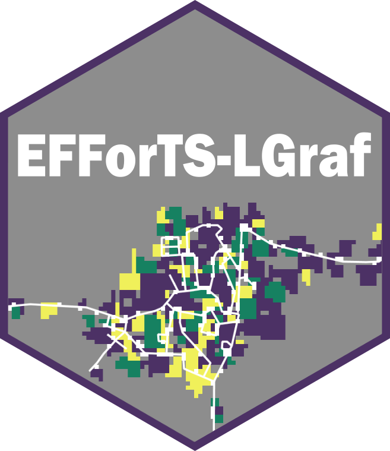

# EFForTS-LGraf Manual 

## Content
This repository contains a manual for the Landscape Generator EFForTS-LGraf: A Landscape Generator for Creating Smallholder-Driven Land-Use Mosaics.

The manual can be accessed via [https://nldoc.github.io/EFForTS-LGraf.bookdown/](https://nldoc.github.io/EFForTS-LGraf.bookdown/)

## EFForTS-LGraf Details

EFForTS-LGraf is implemented in NetLogo and was published under the GNU General Public License v3.0.

The model itself can be downloaded at our [github repository](https://github.com/nldoc/EFForTS-LGraf).

The model description and applications were published as a research article in [PLOS ONE](https://journals.plos.org/plosone/article/authors?id=10.1371/journal.pone.0222949).

If you use EFForTS-LGraf in your research, please cite as:

Salecker J, Dislich C, Wiegand K, Meyer KM, Pe´er G (2019) EFForTS-LGraf: A landscape generator for creating smallholder-driven land-use mosaics. PLOS ONE 14(9): e0222949. https://doi.org/10.1371/journal.pone.0222949

## Notes

The manual has been created with [bookdown](https://bookdown.org/).

